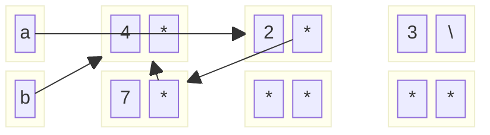

1. For the following code snippets, fill in the box and pointer diagrams to show the
variables and objects created and their contents after executing the snippets,
using the empty boxes provided. After the code executes, some objects may
be unreachable from any named pointer variable (may be “garbage” to use the
technical term); show them anyway.

```
IntList a = IntList.list(1, 2, 3);
IntList b = a;
a.head = 4;
System.out.println(b.head);

a = a.tail;
a.tail = new IntList(7, b);
System.out.println(b.tail.tail.tail.tail.head); 
```

```
1. a -> [1 | *] -> [2 | *] -> [3 | null]
2. b -> [1 | *] -> [2 | *] -> [3 | null]
3. a -> [4 | *] -> [2 | *] -> [3 | null], b -> [4 | *] -> [2 | *] -> [3 | null]
4. Print 4
5. a --> [2 | *] -> [3 | null], b -> [4 | *] -> [2 | *] -> [3 | null]
6. a --> [2 | *] -> [7 | b] --> [4 | *], b -> [4 | *] -> [2 | *] --> [7 | b] -->...
```




---
 **CODE CHALLENGE:** **Finding an Element in a Linked List**
```cpp
## Implementation of Singly Linked List Node class

class Node { 
	public: 
	int value; 
	Node* next = NULL; 
};
```
Write a function find(Node* node, int element) that starts at the given node and either returns true if the element exists somewhere in the **Linked List**, otherwise false if the element does not exist in the **Linked List**. You may choose to implement it either iteratively or recursively: we will pass in the _head_ node when we call your find function, so both approaches have equally valid solutions.

```cpp
## Iterative

bool find(Node* node, int element) {
  while (node != nullptr) {
    if (node->value == element) {
      return true;
    }
    node = node->next;
  }
  return false;
}

## Recursive

bool findRecursive(Node* node, int element){
	## Base case #1 (Element found)
	if (node !=nullptr && node->value == element){
		return true;
	}

	## Base case #2 (End of list, element not found)
	if (node == nullptr){
		return false;
	}
	return findRecursive(node->next, element); 
```
---
**CODE CHALLENGE:** **Inserting an Element into a Linked List**

We have defined the following **Singly Linked List Node** C++ class for you:

```cpp
class Node { 
	public: 
	int value; 
	Node* next = NULL; 
};
```
Write a function insert(Node* head, Node* newnode, int index) that inserts newnode into index of the **Linked List**. We guarantee that we will not have you insert at the very beginning nor the very end of the **Linked List** (so you won't need to worry about updating the _head_ or _tail_ pointers of the **Linked List**).

```cpp
void insert(Node* head, Node* newnode, int index) {
    Node* curr = head;
    for (int i = 1; i < index; ++i) {
        if (curr == nullptr) return;        // safety
        curr = curr->next;
    }
    newnode->next = curr->next;            
    curr->next    = newnode;
}
```
---
Write a function remove(Node* head, int index) that removes the element at index of the **Linked List**. We guarantee that we will not have you remove from the very beginning nor the very end of the **Linked List** (so you won't need to worry about updating the _head_ or _tail_ pointers of the **Linked List**).

```cpp
void remove(Node* head, int index) {
    Node* curr = head;
    for(int i =0; i < index - 1; i++){
		if(curr == nullptr) return;
	    curr = curr->next;
    }
    curr->next = curr->next->next;
}
```