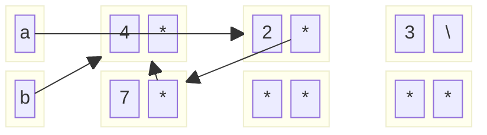

1. For the following code snippets, fill in the box and pointer diagrams to show the
variables and objects created and their contents after executing the snippets,
using the empty boxes provided. After the code executes, some objects may
be unreachable from any named pointer variable (may be “garbage” to use the
technical term); show them anyway.

```
IntList a = IntList.list(1, 2, 3);
IntList b = a;
a.head = 4;
System.out.println(b.head);

a = a.tail;
a.tail = new IntList(7, b);
System.out.println(b.tail.tail.tail.tail.head); 
```

```
1. a -> [1 | *] -> [2 | *] -> [3 | null]
2. b -> [1 | *] -> [2 | *] -> [3 | null]
3. a -> [4 | *] -> [2 | *] -> [3 | null], b -> [4 | *] -> [2 | *] -> [3 | null]
4. Print 4
5. a --> [2 | *] -> [3 | null], b -> [4 | *] -> [2 | *] -> [3 | null]
6. a --> [2 | *] -> [7 | b] --> [4 | *], b -> [4 | *] -> [2 | *] --> [7 | b] -->...
```




---
 **CODE CHALLENGE:** **Finding an Element in a Linked List**
```cpp
## Implementation of Singly Linked List Node class

class Node { 
	public: 
	int value; 
	Node* next = NULL; 
};
```
Write a function find(Node* node, int element) that starts at the given node and either returns true if the element exists somewhere in the **Linked List**, otherwise false if the element does not exist in the **Linked List**. You may choose to implement it either iteratively or recursively: we will pass in the _head_ node when we call your find function, so both approaches have equally valid solutions.

```cpp
## Iterative

bool find(Node* node, int element) {
  while (node != nullptr) {
    if (node->value == element) {
      return true;
    }
    node = node->next;
  }
  return false;
}

## Recursive

bool findRecursive(Node* node, int element){
	## Base case #1 (Element found)
	if (node !=nullptr && node->value == element){
		return true;
	}

	## Base case #2 (End of list, element not found)
	if (node == nullptr){
		return false;
	}
	return findRecursive(node->next, element); 
```
---
**CODE CHALLENGE:** **Inserting an Element into a Linked List**

We have defined the following **Singly Linked List Node** C++ class for you:

```cpp
class Node { 
	public: 
	int value; 
	Node* next = NULL; 
};
```
Write a function insert(Node* head, Node* newnode, int index) that inserts newnode into index of the **Linked List**. We guarantee that we will not have you insert at the very beginning nor the very end of the **Linked List** (so you won't need to worry about updating the _head_ or _tail_ pointers of the **Linked List**).

```cpp
void insert(Node* head, Node* newnode, int index) {
    Node* curr = head;
    for (int i = 1; i < index; ++i) {
        if (curr == nullptr) return;        // safety
        curr = curr->next;
    }
    newnode->next = curr->next;            
    curr->next    = newnode;
}
```
---
Write a function remove(Node* head, int index) that removes the element at index of the **Linked List**. We guarantee that we will not have you remove from the very beginning nor the very end of the **Linked List** (so you won't need to worry about updating the _head_ or _tail_ pointers of the **Linked List**).

```cpp
void remove(Node* head, int index) {
    Node* curr = head;
    for(int i =0; i < index - 1; i++){
		if(curr == nullptr) return;
	    curr = curr->next;
    }
    curr->next = curr->next->next;
}
```
---
## LRU Cache

Cache replacement algorithms are designed such that it replaces the cache when the memory is full. An **LRU Cache** is specifically designed to eliminate the **least recently used** part of the data to make room for new data once the memory is full. The priority of the data in the cache changes according to the need of that data:
- If some data is being fetched, or recently updated, it would be assigned to the **highest priority**.
- The priority of the data will be decreased if it remains unused operations after operations.

**Data structures to implement the LRU Cache:** 
1. **Hash Tables:** Hash tables allow **average constant-time operations** for data retrieval, insertion and also deletion by hashing a value into hashCodes (key). However the disadvantage is that hash tables do not maintain the order of data, so using it alone is not viable for managing the cache priority orders.
2. **Doubly Linked Lists:** Unlike hash tables, a DLL offers us the opportunity to manage the order of data using the `next` and `prev` pointers to navigate through the linked list. Since it uses pointer referencing, insertions and deletions still offers $O(1)$ time-complexity by rearranging the pointer chains. However, it leads to $O(N)$ operations for random access lookup.

**How they complement each others' weakness:**
1. **Maintaining data insertion order:** As addressed, hash table itself does not have the property of maintaining data order as they are stored irregularly (order cannot be guaranteed) by the hash function. However, we can use linked list to keep track of the usage order, making it straightforward to remove the least recently used item when necessary.
2. **Constant access lookup:** Linked lists themselves need to be iterated through their list by navigating through pointers to retrieve the data we wanted. However, the key-value pairs (cache) stored in hash tables can be referenced as nodes, where we can retrieve them using hash map instead. This gives us constant $O(1)$ lookup.

## Most Frequent Item:

You are shown a sequence of N positive integers (stored in an array), identify the one that occurs most frequently. Question is mostly asked in big tech companies for retrieving top K frequent items.

**Idea:** Use a hashmap to store the frequency of each element's frequency, then find the element with max frequency. 

```cpp
int mostFreqItem (vector<int>& arr){
	unordered_map<int, int> freq;
	for(int i=0; i < freq.size(), i++){ //insert all elements
		freq[arr[i]]++;
	}
	int maxCount = 0, result = -1;
	for(auto i : freq){ //iterate through the hashmap
		int val = i.first, count = i.second;
		if(maxCount < count || (count == maxCount && val > res)){
			maxCount = count;
			result = val;
		}
	}
	return result;
}
```


**O(1) Space:** We sort the array to have the most frequently appear element, then search for that particular element.

```cpp
int mostFreqItem (vector<int>& arr){
	sort(arr.begin(), arr.end());

	int maxCount = 1, result = arr[0], currentCount=1; 
	for(int i=0; i <arr.size(); i++){
		if(arr[i] == arr[i-1]){
			currentCount++;
		}else{
			currentCount = 1;
		}
		
		if(currentCount > maxCount && (currentCount == maxCount && arr[i] > result)){
			maxCount = currentCount;
			result = arr[i];
		}
	}
	return result;
}
```

## Checkerboard DP

You are given a checkerboard with n rows and n columns. This is just a $n \times n$ table $V$. The $(i, j)$ entry of $V$ has value $v(i, j)$ (can be positive or negative). We want to move a checker from the top-left corner (i.e., position $(1, 1)$) to the bottom-right (i.e., position $(n, n)$). The only legal moves are to move a checker down by one square, right by one square, or diagonally down-right by one square. The value of a sequence of moves is the sum of the values of the entries in the sequence. We want the maximum value of any legal sequence of moves. Here is an example of a $3 \times 3$ checkerboard:

|   | 1  | 2  | 3  |
|---|----|----|----|
| 1 | 3  | 30 | 12 |
| 2 | -12| 7  | -9 |
| 3 | 39 | -2 | 15 |
The sequence of moves (1, 1) → (1, 2) → (2, 2) → (3, 3) is legal and has total value 3 + 30 + 7 + 15 = 55. Give a dynamic programming algorithm that given the values V determines the maximum value of any legal sequence of moves from (1, 1) to (n, n). You just need to output the total value from the optimal solution. (Faster (and correct) algorithm in O(·) notation is worth more credit.) (a) Define the entries of your table in words. E.g., T(i) is ..., or T(i, j) is ....

### Pseudocode for calculating maximum total value of the sequence:

```
	// V is the n times n checkerboard with value
	// n is the number of rows and columns
	
	//create a 2d DP array
	//dp[i][j] will store the maximum value to reach cell (i,j)
	
	dp = new Array [1...n][1...n];
	
	//base case starting at (1,1):
	dp[1][1] = V[1][1]; 
	
	//Fill the DP table:
	for(int i=1; i < n; i++){
		for(int j=1; j < n; i++){
		if i == 1 & j == 1{
			continue;
		}
		dp[i][j] = V[i][j] + 
		max({ dp[i-1][j], // from above 
		dp[i][j-1], // from left 
		dp[i-1][j-1] // from diagonal 
		})
		}
	}
	return dp[n][n]
```