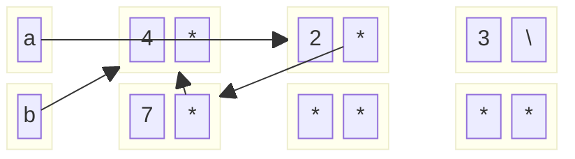

1. For the following code snippets, fill in the box and pointer diagrams to show the
variables and objects created and their contents after executing the snippets,
using the empty boxes provided. After the code executes, some objects may
be unreachable from any named pointer variable (may be “garbage” to use the
technical term); show them anyway.

```
IntList a = IntList.list(1, 2, 3);
IntList b = a;
a.head = 4;
System.out.println(b.head);

a = a.tail;
a.tail = new IntList(7, b);
System.out.println(b.tail.tail.tail.tail.head); 
```

```
1. a -> [1 | *] -> [2 | *] -> [3 | null]
2. b -> [1 | *] -> [2 | *] -> [3 | null]
3. a -> [4 | *] -> [2 | *] -> [3 | null], b -> [4 | *] -> [2 | *] -> [3 | null]
4. Print 4
5. a --> [2 | *] -> [3 | null], b -> [4 | *] -> [2 | *] -> [3 | null]
6. a --> [2 | *] -> [7 | b] --> [4 | *], b -> [4 | *] -> [2 | *] --> [7 | b] -->...
```




